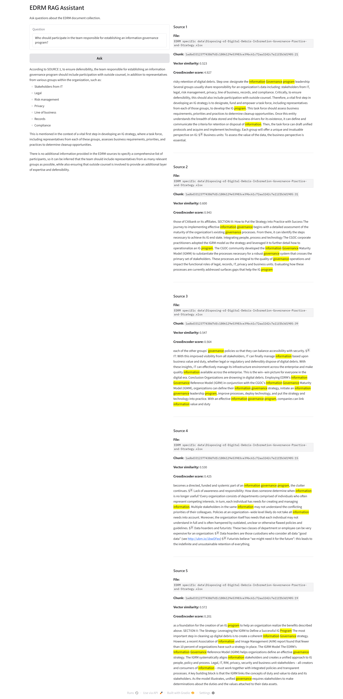

# EDRM RAG Assistant

A local Retrieval-Augmented Generation (RAG) system for querying the EDRM document collection.

The project combines dense semantic retrieval, BM25 lexical retrieval, Reciprocal Rank Fusion (RRF), CrossEncoder reranking, and a locally running LLM through Ollama. A Gradio interface displays generated answers together with the retrieved source passages and retrieval scores.



## Architecture

```text
EDRM documents
      ↓
Parsing / cleaning / chunking
      ↓
┌────────────────────────────┐
│ Dense retrieval (MiniLM)   │
│             +              │
│ BM25 lexical retrieval     │
└─────────────┬──────────────┘
              ↓
 Reciprocal Rank Fusion (RRF)
              ↓
    CrossEncoder reranking
              ↓
        Top-5 passages
              ↓
       Llama 3.2 / Ollama
              ↓
 Grounded answer + citations
              ↓
          Gradio UI
```

## Features

- Multi-format EDRM document ingestion and text extraction
- Text cleaning and chunking
- Persistent Chroma vector database
- Dense retrieval with `sentence-transformers/all-MiniLM-L6-v2`
- BM25 lexical retrieval
- Reciprocal Rank Fusion (RRF)
- CrossEncoder reranking with `cross-encoder/ms-marco-MiniLM-L6-v2`
- Local answer generation with Llama 3.2 through Ollama
- Source-grounded prompting
- Gradio web interface
- Query-term highlighting in retrieved passages
- Retrieval evaluation using MRR and Hit@K

## Retrieval Pipeline

The system uses two complementary retrieval methods.

### Dense retrieval

Document chunks are embedded using:

```text
sentence-transformers/all-MiniLM-L6-v2
```

The embeddings are stored in Chroma and compared with the query embedding using cosine similarity.

### BM25 retrieval

BM25 provides lexical retrieval based on term occurrence and document statistics. It can recover relevant passages that semantic vector retrieval does not place among its top candidates.

### Reciprocal Rank Fusion

The ranked candidate lists produced by dense retrieval and BM25 are combined using Reciprocal Rank Fusion:

```text
RRF score(d) = Σ 1 / (k + rank(d))
```

The project uses:

```text
k = 60
```

### CrossEncoder reranking

The fused candidates are reranked using:

```text
cross-encoder/ms-marco-MiniLM-L6-v2
```

The five highest-ranked passages are supplied to the generative model.

## Evaluation

A 20-query EDRM development set was used to compare retrieval configurations.

| Retrieval method | MRR@5 | Hit@1 | Hit@3 | Hit@5 |
|---|---:|---:|---:|---:|
| Dense retrieval | 0.552 | 45% | 60% | 75% |
| Dense + CrossEncoder | 0.775 | 70% | 85% | 85% |
| Hybrid + CrossEncoder | **0.850** | **80%** | **90%** | **90%** |

The hybrid pipeline improved MRR@5 from 0.775 to 0.850 compared with dense retrieval followed by CrossEncoder reranking.

The evaluation set is a development set rather than an independent held-out benchmark, so these results should be interpreted as development results for this corpus.

## Project Structure

```text
edrm-rag/
├── assets/
│   └── edrm-rag-demo.png
├── data/
│   ├── raw/
│   ├── extracted/
│   ├── processed/
│   └── index/
├── eval/
│   └── edrm_queries.jsonl
├── src/
│   ├── app.py
│   ├── evaluate.py
│   ├── extract.py
│   ├── index.py
│   ├── ingest.py
│   ├── rag.py
│   └── view_chunks.py
├── requirements.txt
└── README.md
```

## Installation

Create a Python environment and install the dependencies:

```bash
pip install -r requirements.txt
```

Ollama must also be installed and running locally.

Pull the Llama 3.2 model:

```bash
ollama pull llama3.2
```

## Running the Pipeline

### 1. Extract the EDRM dataset

```bash
python src/extract.py
```

### 2. Parse and chunk the documents

```bash
python src/ingest.py
```

### 3. Build the vector index

```bash
python src/index.py
```

### 4. Run the retrieval evaluation

```bash
python src/evaluate.py
```

### 5. Start the RAG application

```bash
python src/app.py
```

The Gradio interface is then available locally, normally at:

```text
http://127.0.0.1:7860
```

## Example Query

```text
What problems can excessive amounts of unnecessary
organizational data create?
```

The application retrieves candidate passages using both MiniLM and BM25, fuses the rankings, reranks the candidates with the CrossEncoder, and supplies the best passages to the local LLM.

The interface displays:

- generated answer
- source file
- chunk identifier
- vector similarity
- BM25 score
- CrossEncoder score
- highlighted query terms in each retrieved passage

## Models and Technologies

- Python
- Chroma
- Sentence Transformers
- MiniLM
- BM25
- Reciprocal Rank Fusion
- CrossEncoder
- Ollama
- Llama 3.2
- Gradio

## Future Work

Possible extensions include:

- held-out retrieval evaluation
- fine-tuning the embedding model
- fine-tuning the CrossEncoder reranker
- LoRA/QLoRA fine-tuning of the generative LLM
- larger legal document collections
- retrieval and generation evaluation on additional legal-domain tasks

## Purpose

This project demonstrates an end-to-end local RAG architecture for document retrieval and grounded question answering, with particular emphasis on hybrid retrieval and quantitative evaluation of retrieval quality.

## License

The source code in this repository is licensed under the MIT License.

The EDRM dataset, third-party models, libraries, and other external resources used by this project remain subject to their respective licenses and terms.
